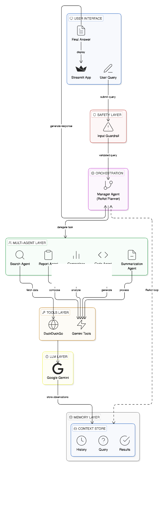

🧠 Autonomous AI Research & Implementation Assistant

This project is an agentic AI system that can understand a user query, decide how to solve it, and dynamically use multiple specialized agents to produce a final answer.

Unlike traditional AI applications that follow a fixed pipeline, this system uses a ReAct (Reason + Act) loop, allowing it to think step-by-step and choose actions intelligently.

Most AI systems today:
 Follow a fixed pipeline (search → summarize → output)
 Cannot adapt to different query types
 Treat all queries the same way

Our Solution

We built a multi-agent system where:
✔ The system decides WHAT to do (Planner)
✔ Specialized agents decide HOW to do it
✔ Tools execute the actual operations

This makes the system:
✔ Dynamic
✔ Context-aware
✔ Adaptive to different queries

🧠 Core Idea: ReAct-Based Agent System

The system follows a ReAct loop:
Thought → Action → Observation → Repeat → Final Answer

⚙️ How the System Works
Step-by-step flow:

1. User gives a query
2. Safety Guardrail (checks if query is according to policy)
3. Manager (Planner Agent) analyzes the query
4. Decides the next best action:
   - search
   - summarize
   - code
   - compare
   - report
5. Calls the corresponding agent
6. Agent uses its tool to perform the task
7. Result is stored in context
8. Manager re-evaluates and decides next step
9. Loop continues until task is complete
10. Final answer is generated using all collected information

🧩 Key Components :
🧠 Manager Agent (Planner) :
Central brain of the system
Uses LLM reasoning
Decides next action dynamically
Prevents unnecessary steps

🤖 Specialized Agents

Each agent has a single responsibility:

🔍 Search Agent → fetch external information.
🧾 Summarization Agent → simplify content.
💻 Code Agent → generate code.
📊 Comparison Agent → structured comparisons.
📝 Report Agent → final structured output.
🛠️ Tools (Execution Layer).

Agents use tools to perform actions:
SearchTool → DuckDuckGo.
LLM Tools → Gemini API.

🛡️ Safety Guardrail :
Filters unsafe or harmful queries .
Ensures responsible AI behavior.
Prevents misuse of the system.

🧠 Context Memory :

Stores:
- Query.
- Previous actions.
- Observations.
- Results.

This enables:
✔ Multi-step reasoning.
✔ Avoiding repeated actions.
✔ Context-aware decisions.

🔁 Example Execution:

Query:
"Compare RNN and LSTM"?

Execution:
Step 1:
Thought → Need comparison.
Action → compare.

Step 2:
Thought → Enough info.
Action → finish.

🖥️ User Interface:
Built with Streamlit
Sequential output (like ChatGPT)
Displays:
Final answer
Comparison / Code / Summary (if applicable)
Sources (if used)

🛠️ Tech Stack:
Python
Streamlit
Gemini API
DuckDuckGo Search
ReAct Architecture

⚙️ Setup & Installation:
🔧 Prerequisites:
Python 3.9+
Git
Internet connection (for API calls)

Installation : 
git clone https://github.com/your-username/your-repo.git .
cd AI_Research_Agent .

python -m venv venv
source venv/bin/activate      # Mac/Linux
venv\Scripts\activate         # Windows

pip install -r requirements.txt

🔑 API Key Setup

This project uses Google Gemini API

Step 1: Get API Key
Go to: https://ai.google.dev/
Generate API key
🌱 Environment Configuration

Create a .env file:
GEMINI_API_KEY=your_api_key_here

Run command : 
streamlit run app.py

🧪 Testing
✅ Unit Testing

Each agent can be tested independently:
pytest tests/test_agents.py

